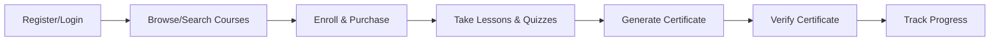
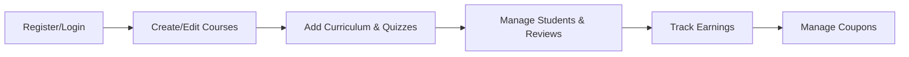

<div align="center">
  
  
  <h1>Knowledge Ledger 🚀</h1>
  <p><b>Cardano Blockchain-Powered Learning Management System</b></p>
  
  <p>
    
    
    
    
    
    
    
    
    <!-- Add more badges as needed -->
  </p>

    
   
</div>

---

<div align="justify">

> **Empowering the next generation of Web3 learners and educators with decentralized, verifiable credentials.**

---
## 🏆 Project Highlights

- **🔗 Blockchain-anchored credentials** for trustless verification.
- **🧩 Modular, scalable architecture** using Next.js 14 App Router.
- **💡 Modern UI/UX** with shadcn/ui, Tailwind CSS, and Radix UI.
- **⚡ Real-time feedback** with toast notifications and analytics.
- **🌐 Global-ready**: easily localizable and mobile-first.
- **🛡️ Secure, role-based access** for students and instructors.
- **💳 E-commerce ready**: shopping cart, checkout, and coupon management.

---

## 🗂️ Table of Contents

- [🏆 Project Highlights](#-project-highlights)
- [✨ Overview](#-overview)
- [🔥 Features](#-features)
- [🧰 Full Tech Stack](#-full-tech-stack)
- [🧩 Component Structure](#-component-structure)
- [👥 User Roles & Flows](#-user-roles--flows)
- [💎 What Makes Knowledge Ledger Unique?](#-what-makes-starlord-lms-unique)
- [🛠️ Setup & Development](#️-setup--development)
- [📁 Directory Structure](#-directory-structure)
- [🤝 Contributing](#-contributing)
- [📝 License](#-license)
- [🙌 Credits](#-credits)
- [👨‍💻 About the Author](#-about-the-author)
- [👥 Contributors](#-contributors)
- [🙋‍♂️ Why We Built This](#-why-we-built-this)
- [🔮 Future Plans](#-future-plans)
- [�� FAQ](#-faq)

---

## ✨ Overview

**Knowledge Ledger** is a next-generation Learning Management System (LMS) focused on blockchain and Web3 technology education. Built on the Cardano blockchain, it offers a decentralized, verifiable, and transparent platform for both students and instructors. The platform enables learners to earn immutable, blockchain-stored certificates and credentials, while instructors can create, manage, and monetize high-quality courses.

</div>

<div align="center">
  <h3><b>Certificate Example</b></h3>
  
</div>

<div align="justify">

### 🎯 Mission

> We are a cutting-edge educational platform dedicated to blockchain and Web3 technology education. Our mission is to make high-quality learning resources accessible to everyone interested in the future of technology. We offer comprehensive courses taught by industry experts, designed to take you from beginner to expert.

---

## 🔥 Features

### 🛡️ Blockchain-Powered Learning

- <b>Immutable Certificates:</b> All course completions are recorded on the Cardano blockchain, ensuring permanent, tamper-proof verification.
- <b>Certificate Verification:</b> Anyone can verify the authenticity of a certificate using its unique ID.
- <b>Decentralized Identity:</b> Secure, blockchain-based authentication for students and instructors.

### 🎓 For Students

- <b>Course Enrollment:</b> Browse, search, and enroll in a wide range of blockchain and Web3 courses.
- <b>Learning Dashboard:</b> Track enrolled courses, completed lessons, and earned certificates.
- <b>Wishlist:</b> Save courses for later.
- <b>Quizzes:</b> Take quizzes to assess knowledge and unlock certificates.
- <b>Certificate Generation:</b> Instantly generate and download blockchain-anchored certificates upon course completion.
- <b>Profile Management:</b> Edit personal details, change password, and view learning stats.

### 🧑‍🏫 For Instructors

- <b>Course Creation:</b> Create, edit, and manage courses with rich content (CKEditor integration for descriptions, video uploads, etc.).
- <b>Curriculum Builder:</b> Organize course content into modules and lectures.
- <b>Quiz Management:</b> Add, edit, and manage quizzes and questions for each course.
- <b>Earnings Dashboard:</b> Track revenue, student enrollments, and course performance.
- <b>Coupon Management:</b> Create and manage discount coupons for courses.
- <b>Student Management:</b> View enrolled students, answer questions, and manage reviews.

### 💳 E-Commerce & Payments

- <b>Shopping Cart:</b> Add courses to cart, manage items, and proceed to checkout.
- <b>Checkout & Payment:</b> Secure payment integration (Razorpay, Stripe, etc.) for course purchases.
- <b>Order Management:</b> Track orders, apply coupons, and view payment status.

### 🌍 General

- <b>Responsive UI:</b> Modern, mobile-friendly interface using Tailwind CSS and shadcn/ui components.
- <b>Notifications:</b> Real-time feedback and toast notifications for user actions.
- <b>Globalization:</b> Support for multiple languages and global user base.
- <b>Role-Based Access:</b> Separate dashboards and flows for students and instructors.

---

## 🧰 Full Tech Stack
</div>

| Category         | Technology / Library                | Purpose / Notes                                 |
|------------------|------------------------------------|-------------------------------------------------|
| **Framework**    | Next.js 14, React 18               | SSR/SSG, Routing, UI                            |
| **Language**     | TypeScript                         | Type safety, maintainability                    |
| **Styling**      | Tailwind CSS, shadcn/ui, Radix UI  | Modern, accessible, customizable UI             |
| **State**        | Zustand                            | Lightweight, scalable state management          |
| **Blockchain**   | Mesh SDK, Cardano                  | Wallet connect, certificate minting/verification|
| **Forms**        | React Hook Form, Zod               | Robust forms, validation                        |
| **Rich Content** | CKEditor 5                         | WYSIWYG for course content                      |
| **API**          | Axios                              | RESTful API calls                               |
| **Notifications**| react-hot-toast, SweetAlert2       | User feedback                                   |
| **Charts**       | Chart.js, Recharts                 | Analytics, dashboards                           |
| **Icons**        | Lucide, Heroicons                  | Consistent, modern iconography                  |
| **Testing**      | Jest, React Testing Library        | (Recommended)                                   |
| **Linting**      | ESLint, Prettier                   | Code quality, formatting                        |
| **Deployment**   | Vercel, Docker (recommended)       | CI/CD, scalable deployment                      |


<div align="justify">

---

## 🧩 Component Structure

</div>

<details>
<summary><b>Click to expand</b></summary>

<div align="justify">

- <b>/components/ui/</b>: Reusable UI primitives (buttons, dialogs, forms, tables, etc.)
- <b>/components/student/</b>: Student-specific UI (Sidebar, Header, etc.)
- <b>/components/instructor/</b>: Instructor-specific UI (Sidebar, Header, etc.)
- <b>/components/WalletConnectModal.tsx</b>: Cardano wallet connection modal
- <b>/providers/</b>: Context providers for cart and blockchain wallet
- <b>/views/plugins/</b>: Utility plugins for user data, country detection, toast notifications, etc.

</div>

</details>

<div align="justify">

---

## 👥 User Roles & Flows

### 🧑‍🎓 Students

</div>



<div align="justify">

### 🧑‍🏫 Instructors

</div>



---

## 💎 What Makes Knowledge Ledger Unique?

- **Verifiable, tamper-proof credentials** for every learner.
- **Seamless instructor and student experiences** with role-based dashboards.
- **Plug-and-play blockchain integration** (Cardano, easily extendable).
- **Modern, accessible, and responsive UI**.
- **Built for scale and extensibility**.
- **Best practices in code quality, security, and modularity.**

---

## 🛠️ Setup & Development

> **Prerequisites:** Node.js 18+, Yarn, npm, or pnpm

### 🚀 Installation

```bash
git clone <repo-url>
cd next14frontend
npm install # or yarn install
```

### 🏃 Running Locally

```bash
npm run dev # or yarn dev
```

Visit [http://localhost:3000](http://localhost:3000) in your browser.

### 🏗️ Building for Production

```bash
npm run build
npm start
```

---

## 📁 Directory Structure

```text
next14frontend/
├── public/                # Static assets (images, icons, etc.)
├── src/
│   ├── app/               # Next.js app directory (routing, pages)
│   │   ├── (auth)/        # Auth pages (login, register, etc.)
│   │   ├── (base)/        # Core app pages (cart, checkout, etc.)
│   │   ├── instructor/    # Instructor dashboard and features
│   │   ├── student/       # Student dashboard and features
│   │   ├── api/           # API routes (if any)
│   │   ├── about-us/      # About page
│   │   ├── contact-us/    # Contact page
│   │   └── layout.tsx     # Global layout and providers
│   ├── components/        # UI and feature components
│   ├── hooks/             # Custom React hooks
│   ├── lib/               # Utility libraries
│   ├── providers/         # Context providers
│   ├── store/             # Zustand stores
│   ├── types/             # TypeScript type definitions
│   ├── utils/             # Utility functions (auth, axios, etc.)
│   └── views/plugins/     # Plugins for user data, toast, etc.
├── package.json           # Project metadata and dependencies
├── tailwind.config.ts     # Tailwind CSS configuration
└── README.md              # Project documentation
```

---

## 🤝 Contributing

Contributions are welcome! Please open issues and pull requests for new features, bug fixes, or documentation improvements.

---

## 📝 License

This project is licensed under the MIT License:

```text
MIT License

Copyright (c) 2024 Vinit Inamke

Permission is hereby granted, free of charge, to any person obtaining a copy
of this software and associated documentation files (the "Software"), to deal
in the Software without restriction, including without limitation the rights
to use, copy, modify, merge, publish, distribute, sublicense, and/or sell
copies of the Software, and to permit persons to whom the Software is
furnished to do so, subject to the following conditions:

The above copyright notice and this permission notice shall be included in all
copies or substantial portions of the Software.

THE SOFTWARE IS PROVIDED "AS IS", WITHOUT WARRANTY OF ANY KIND, EXPRESS OR
IMPLIED, INCLUDING BUT NOT LIMITED TO THE WARRANTIES OF MERCHANTABILITY,
FITNESS FOR A PARTICULAR PURPOSE AND NONINFRINGEMENT. IN NO EVENT SHALL THE
AUTHORS OR COPYRIGHT HOLDERS BE LIABLE FOR ANY CLAIM, DAMAGES OR OTHER
LIABILITY, WHETHER IN AN ACTION OF CONTRACT, TORT OR OTHERWISE, ARISING FROM,
OUT OF OR IN CONNECTION WITH THE SOFTWARE OR THE USE OR OTHER DEALINGS IN THE
SOFTWARE.
```

---

## 🙌 Credits

- Built with [Next.js](https://nextjs.org/), [Tailwind CSS](https://tailwindcss.com/), [shadcn/ui](https://ui.shadcn.com/), and [Mesh SDK](https://meshjs.dev/).
- Icons by [Lucide](https://lucide.dev/) and [Heroicons](https://heroicons.com/).

---

## 👨‍💻 About the Author

> **Vinit Inamke** (He/Him)  
> Lead WEB3 Architect @ [KONMA.ORG](https://www.konma.io/)  
> Exploring Socio-Technical Innovation in Decentralized Systems  
> Cardano Developer (Haskell, Plutus, Marlowe)  
> Functional Programming Practitioner  
> CE Graduate  
> Next.js & MERN Stack

[LinkedIn](https://www.linkedin.com/in/vinit-inamke) \| [GitHub](https://github.com/VINIT-INAMKE) \| [Email](mailto:vintinamke004vinitinamke@gmail.com)

---

## 👥 Contributors

- Aaditya Mehetre
- Adnan Shaikh
- Santanu Chatterjee

---

## 🙋‍♂️ Why We Built This

> This project demonstrates my ability to architect, build, and document a full-stack, blockchain-integrated web application from scratch, with a focus on scalability, security, and user experience. It showcases advanced skills in decentralized systems, modern frontend frameworks, and collaborative open source development.

---

## 🔮 Future Plans

- [ ] Multi-chain support (Ethereum, Solana, etc.)
- [ ] Mobile app (React Native)
- [ ] More analytics for instructors
- [ ] Community forum integration
- [ ] Accessibility enhancements
- [ ] Internationalization (i18n) support
- [ ] Automated testing and CI/CD integration

---

## 💬 FAQ

**Q: Can I add more blockchains?**  
A: Yes! The architecture is modular and can support additional blockchain SDKs.

**Q: Is this production-ready?**  
A: The codebase follows best practices and is ready for further scaling and deployment.

**Q: How do I contribute?**  
A: Fork the repo, create a feature branch, and open a pull request!

---
</div>
